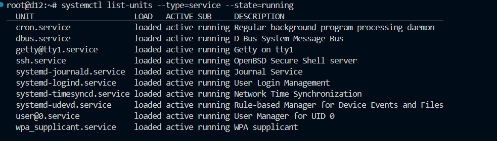
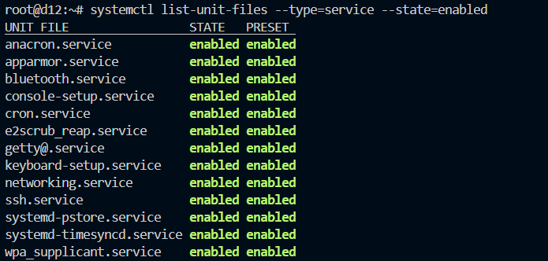

#### Литература
- [systemD с 0 до 1: библия сисадмина](https://habr.com/ru/companies/timeweb/articles/824146/)
- [Управление службами Linux](https://losst.pro/upravlenie-sluzhbami-linux)
- [Systemd: пишем собственные .service и .target](https://habr.com/ru/articles/275645/)
- [Создание собственного сервиса в systemd](https://tinigin.ru/linux/administration/systemd_service.html)
- [Шпаргалка по journalctl](https://losst.pro/shpargalka-po-journalctl-v-linux)
- [Продвинутая работа с логами в Linux](https://habr.com/ru/articles/749714/)
- [Монтирование файловых систем при помощи systemd](https://interface31.ru/tech_it/2022/09/montirovanie-faylovyh-sistem-pri-pomoshhi-systemd.html)

## Часть 1. Получение информацию о времени загрузки
### 1. Выведите информацию о времени, затраченном на загрузку системы

### 2. Выведите список всех запущенных при страте системы сервисов, в порядке уменьшения времени, затраченного на загрузку сервиса.
```
systemd-analyze blame
1.229s dev-sda1.device
1.042s e2scrub_reap.service
 981ms networking.service
 916ms apparmor.service
 864ms systemd-timesyncd.service
 733ms systemd-binfmt.service
 529ms keyboard-setup.service
 358ms systemd-udev-trigger.service
 355ms systemd-logind.service
 301ms modprobe@drm.service
 297ms systemd-journald.service
 219ms dbus.service
 179ms systemd-udevd.service
 166ms modprobe@dm_mod.service
 165ms user@0.service
 162ms systemd-journal-flush.service
```
### 3. Выведите список сервисов, запуск которых с необходимостью предшествовал запуску сервиса sshd.
```
systemctl list-dependencies sshd

sshd.service
● ├─-.mount
● ├─system.slice
● └─sysinit.target
●   ├─apparmor.service
●   ├─dev-hugepages.mount
●   ├─dev-mqueue.mount
●   ├─keyboard-setup.service
●   ├─kmod-static-nodes.service
●   ├─proc-sys-fs-binfmt_misc.automount
●   ├─sys-fs-fuse-connections.mount
●   ├─sys-kernel-config.mount
●   ├─sys-kernel-debug.mount
●   ├─sys-kernel-tracing.mount
●   ├─systemd-ask-password-console.path
●   ├─systemd-binfmt.service
```
### 4. Сформируйте изображение в формате svg с графиком загрузки системы, сохраните его в файл.
```
systemd-analyze plot > boot-analyze.svg
```
## Часть 2. Управление юнитами.
### 1. Получите список всех запущенных юнитов сервисов
```
systemctl list-units --type=service --state=running
```

### 2. Выведите перечень всех юнитов сервисов, для которых назначена автозагрузка

### 3. Определите от каких юнитов зависит сервис sshd. 
```
systemctl show sshd | grep Requires=
Requires=sysinit.target -.mount system.slice
```
### 4. Определите запущен ли сервис cron, если нет, запустите его
```
systemctl status cron
systemctl start cron
```
### 5. Выведите все параметры юнита cron, даже те, которые были назначены автоматически, и не были прописаны в файле юнита. 
```
systemctl show cron
# Действительно, пропишет больше, чем
# systemctl cat cron
```
### 6. Запретите автозагрузку сервиса cron, но оставите ему возможность запускаться по зависимостям.
```
systemctl disable cron
```
## Часть 3. Создание сервиса
### 1. Создайте собственный сервис mymsg. Сервис mymsg должен при старте системы записывать в системный журнал дату и время, а также должен запускаться только если запущен сервис network.
```
touch /etc/systemd/system/mymsg.service

[Unit]
Description=MsgServiceForLab
After=network.target # Запуск только после

[Service]
ExecStart=/bin/bash -c 'logger "Service mymsg started at $(date)"' # В системный журнал
Type=oneshot

[Install]
WantedBy=multi-user.target # стандартное состояние для многопользовательской системы без графического интерфейса
```
### 2. Настройте автоматический запуск сервиса mymsg при старте системы
```
systemctl enable mymsg
```
### 3. Запустите сервис.
```
systemctl start mymsg
```
## Часть 4. Работа с системным журналом
### 1. Выведите на консоль системный журнал. Убедитесь, что сервис mymsg отработал корректно
```
journalctl -e # отображаем только последние

мар 08 12:52:00 d12 systemd[1]: Starting mymsg.service - My Message Service...
мар 08 12:52:00 d12 root[2714]: Service mymsg started at Сб 08 мар 2025 12:52:00 MSK
мар 08 12:52:00 d12 systemd[1]: mymsg.service: Deactivated successfully.
мар 08 12:52:00 d12 systemd[1]: Finished mymsg.service - My Message Service.
```
### 2. Выведите на консоль все сообщения системного журнала, касающиеся сервиса mymsg.
```
journalctl -u mymsg # Всё, что касается этого Юнита

мар 08 12:52:00 d12 systemd[1]: Starting mymsg.service - My Message Service...
мар 08 12:52:00 d12 systemd[1]: mymsg.service: Deactivated successfully.
мар 08 12:52:00 d12 systemd[1]: Finished mymsg.service - My Message Service.
```
### 3. Выведите на экран все сообщения об ошибках в журнале.
```
journalctl -p err
сен 03 17:43:10 d12 systemd[1]: Invalid DMI field header.
сен 03 17:43:13 d12 kernel: [drm:vmw_host_printf [vmwgfx]] *ERROR* Failed to send host log message.
-- Boot 6680dfb9c8c7440b963d52d9942555d6 --
мар 08 11:01:27 d12 systemd[1]: Invalid DMI field header.
-- Boot 3662c07df5184572a6270c3e78789b53 --
мар 08 11:02:49 d12 systemd[1]: Invalid DMI field header.
мар 08 11:02:53 d12 kernel: [drm:vmw_host_printf [vmwgfx]] *ERROR* Failed to send host log message.
-- Boot ba3b045037bc46b7a71df02f9b4927ae --
мар 08 11:05:32 d12 systemd[1]: Invalid DMI field header.
мар 08 11:05:33 d12 kernel: [drm:vmw_host_printf [vmwgfx]] *ERROR* Failed to send host log message.
```
### 4. Определите размер журнала
```
journalctl --disk-usage
Archived and active journals take up 20.2M in the file system.
```
## Часть 5. Создание и настройка .mount юнита
### 1. Подготовьте файловую систему
```
Вспомним знания предков и добавим новый VDI, и его будем нашинковывать для пятой и шестой части
```
#### a. Создайте новый раздел на диске или используйте существующий.
```
fdisk /dev/sdb
# Дважды создаем партишины для пятой и шестой тасок
```
#### b. отформатируйте его в файловую систему ext4
```
mkfs.ext4 /dev/sdb1
```
#### c. Создайте директорию для монтирования /mnt/mydata
```
mkdir /mnt/mydata
```
### 2. Создание .mount юнита
#### a. Создайте файл .mount юнита в /etc/systemd/system/mntmydata.mount.
```
touch /etc/systemd/system/mnt-mydata.mount
```
#### b. Настройте юнит следующим образом:
1) Добавьте описание юнита в секцию [Unit]. 
2) В секции [Mount] укажите устройство, точку монтирования, тип файловой системы и опции. 
3) В секции [Install] укажите, что юнит должен быть активирован при достижении multi-user.target.
```
[Unit]
Description=DoingPart5

[Mount]
What=/dev/sdb1
Where=/mnt/mydata
Type=ext4
Options=defaults

[Install]
WantedBy=multi-user.target
```
#### c. Сохраните файл и выйдите из редактора
```
OK, понял, принял
```
### 3. Запуск и проверка .mount юнита
#### a. Включите и запустите юнит. 
```
systemctl enable mnt-mydata.mount
systemctl start mnt-mydata.mount
```
#### b. Проверьте статус юнита. 
```
systemctl status mnt-mydata.mount
● mnt-mydata.mount - DoingPart5
     Loaded: loaded (/etc/systemd/system/mnt-mydata.mount; enabled; preset: enabled)
     Active: active (mounted) since Sat 2025-03-08 14:09:48 MSK; 17s ago
      Where: /mnt/mydata
       What: /dev/sdb1
      Tasks: 0 (limit: 1108)
     Memory: 88.0K
        CPU: 16ms
     CGroup: /system.slice/mnt-mydata.mount
```
#### c. Убедитесь, что раздел смонтирован.
```
mount | grep /mnt/mydata
/dev/sdb1 on /mnt/mydata type ext4 (rw,relatime)
```

## Часть 6. Использование .automount для отложенного монтирования
### 1. Подготовьте файловую систему.
```
Аналогично предыдущей части. Используем sdb2
и создадим директорию /mnt/mydata_auto
```
## 2. Создание .automount юнита
#### a. Создайте файл .automount юнита в /etc/systemd/system/mntmydata.automount.
```
touch /etc/systemd/system/mnt-mydata.automount
```
#### b. Настройте юнит:
1) В секции [Unit] добавьте описание.
2) В секции [Automount] укажите точку монтирования и время до размонтирования (TimeoutIdleSec). 
3) В секции [Install] укажите, что юнит должен быть активирован при достижении multi-user.target.
```
[Unit]
Description=DoingPart6

[Automount]
Where=/mnt/mydata
TimeoutIdleSec=60

[Install]
WantedBy=multi-user.target
```
#### c. Сохраните файл и выйдите из редактора.
```
OKKKKKK
```
### 3. Запуск и проверка .automount юнита
#### a. Включите и запустите .automount юнит.
```
systemctl enable mnt-mydata.automount

# Выключим .mount-юнит, чтобы .automount дать сделать своё дело
systemctl stop mnt-mydata.mount
systemctl disable mnt-mydata.mount
```
#### b. Проверьте статус юнита и убедитесь, что раздел монтируется при обращении к точке монтирования.
```
systemctl status mnt-mydata.automount
● mnt-mydata.automount - DoingPart6
     Loaded: loaded (/etc/systemd/system/mnt-mydata.automount; enabled; preset: enabled)
     Active: active (waiting) since Sat 2025-03-08 14:52:30 MSK; 13s ago
   Triggers: ● mnt-mydata.mount
      Where: /mnt/mydata

Далее переходим к директории и видим:

systemctl status mnt-mydata.automount
● mnt-mydata.automount - DoingPart6
     Loaded: loaded (/etc/systemd/system/mnt-mydata.automount; enabled; preset: enabled)
     Active: active (running) since Sat 2025-03-08 14:52:30 MSK; 25s ago
   Triggers: ● mnt-mydata.mount
      Where: /mnt/mydata
```
#### c. Убедитесь, что раздел размонтируется после завершения работы.
```
# Видим, что переходит в waiting после ожидания

mnt-mydata.automount - DoingPart6
     Loaded: loaded (/etc/systemd/system/mnt-mydata.automount; enabled; preset: enabled)
     Active: active (waiting) since Sun 2025-03-09 15:45:43 MSK; 13min ago
   Triggers: ● mnt-mydata.mount
      Where: /mnt/mydata

мар 09 15:45:43 d12 systemd[1]: Set up automount mnt-mydata.automount - DoingPart6.
мар 09 15:45:59 d12 systemd[1]: mnt-mydata.automount: Got automount request for /mnt/mydata, triggered by 617 (node)
мар 09 15:49:18 d12 systemd[1]: mnt-mydata.automount: Got automount request for /mnt/mydata, triggered by 804 (rg)
мар 09 15:52:13 d12 systemd[1]: mnt-mydata.automount: Got automount request for /mnt/mydata, triggered by 1118 (ls)
```

### Вопросы и задания:
#### 1. Чем отличаются команды systemctl restart и systemctl try-restart?
- `systemctl restart` перезапускает сервис независимо от его текущего состояния.
- `systemctl try-restart` перезапускает сервис только если он уже запущен.
#### 2. Как с помощью systemctl запустить Linux в однопользовательском режиме?
```
systemctl rescue
# Вводим в режим восстановления. В этом режиме все локальные файловые системы будут примонтированы, но только некоторые важные службы будут запущены. Например, сетевые сервисы не будут запущены.
```
#### 3. Пусть вам нужно создать еще один сервис mysrv, который не будет запускаться автоматически, и может быть выполнен, только если сервис mymsg будет принудительно остановлен уже после старта системы. Приведите параметры и их значения из описания юнитов mymsg и mysrv, которые обеспечат выполнения этих условий.
```
# В [Unit] нужно написать следующее:
Conflicts=mymsg.service
```